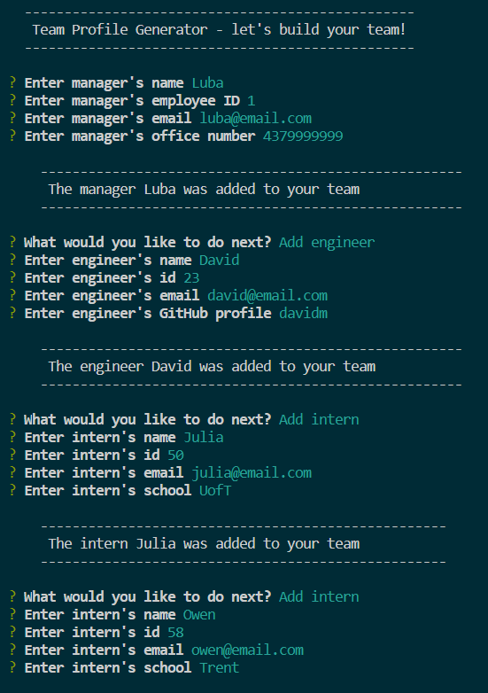
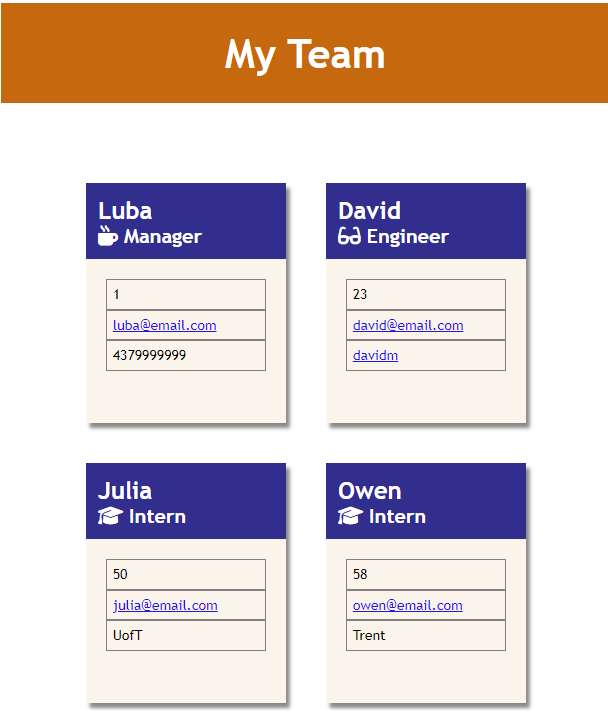

# Team Profile Generator

## Description

The aim of this project was to create a team profile generator. This command-line application helps users to create a team that may include a manager, engineers, and interns, by asking questions and generating an HTML page based on their answers. This application will allow users to generate a professionally designed page that will showcase the whole team, including information about each team member, such as name, id, and their role in the company. Working on this project helped me gaininng further understanding of how to create an interactive app outside the browser that communicates with the user, collects data, and writes it onto a separate file.

## Installation

To create this generator, the 8.2.4 version of the Inquirer NPM and Jest.js testing framework were installed.

## Usage

A user will be prompted with a series of questions. When the app starts, the user will be asked to enter manager info, following which a menu will appear. In the menu, the user will be able to choose to either add another employee (engineer or intern) or to finish building the team.The user may add as many employees as they wish and once they decide to finish building the team, an HTML file will be created. The file will include cards for the manager and each of the added employees. The cards will include the following info for all employees: name, id, role, and email. In addition, for engineers, there will be a link to their GitHub profile, and for interns, a name of their school will appear on the card.

[Walkthrough video](https://watch.screencastify.com/v/XSus5j0BOUJ7G43HSjo3)

## Credits

Luba Mintsys. https://github.com/lmintsys

## License

MIT License

Copyright (c) 2023 lmintsys

Permission is hereby granted, free of charge, to any person obtaining a copy
of this software and associated documentation files (the "Software"), to deal
in the Software without restriction, including without limitation the rights
to use, copy, modify, merge, publish, distribute, sublicense, and/or sell
copies of the Software, and to permit persons to whom the Software is
furnished to do so, subject to the following conditions:

The above copyright notice and this permission notice shall be included in all
copies or substantial portions of the Software.

THE SOFTWARE IS PROVIDED "AS IS", WITHOUT WARRANTY OF ANY KIND, EXPRESS OR
IMPLIED, INCLUDING BUT NOT LIMITED TO THE WARRANTIES OF MERCHANTABILITY,
FITNESS FOR A PARTICULAR PURPOSE AND NONINFRINGEMENT. IN NO EVENT SHALL THE
AUTHORS OR COPYRIGHT HOLDERS BE LIABLE FOR ANY CLAIM, DAMAGES OR OTHER
LIABILITY, WHETHER IN AN ACTION OF CONTRACT, TORT OR OTHERWISE, ARISING FROM,
OUT OF OR IN CONNECTION WITH THE SOFTWARE OR THE USE OR OTHER DEALINGS IN THE
SOFTWARE.
